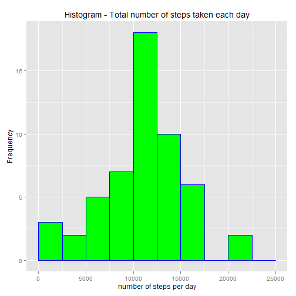
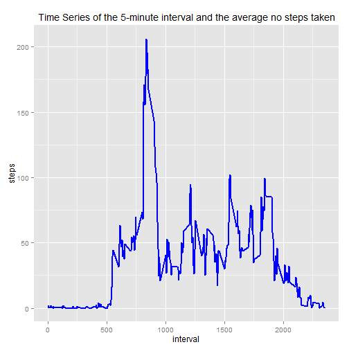
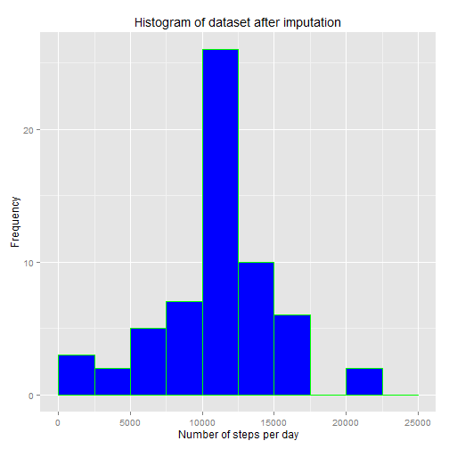

# 1. Loading and preprocessing the data

## 1.1 Load input data

Load libraries and read the input activity dataset with the assumption that is resides in the current working directory.

```r
# Load required libraries
library(dplyr)
library(ggplot2)
library(lattice)

df <- read.csv("activity.csv")
```

## 1.1 Process input data

Process date column and print the first few records and a summary of the data set.

```r
df$date <- as.Date(df$date, "%Y-%m-%d")
head(df)
```

```
##   steps       date interval
## 1    NA 2012-10-01        0
## 2    NA 2012-10-01        5
## 3    NA 2012-10-01       10
## 4    NA 2012-10-01       15
## 5    NA 2012-10-01       20
## 6    NA 2012-10-01       25
```

```r
summary(df)
```

```
##      steps             date               interval     
##  Min.   :  0.00   Min.   :2012-10-01   Min.   :   0.0  
##  1st Qu.:  0.00   1st Qu.:2012-10-16   1st Qu.: 588.8  
##  Median :  0.00   Median :2012-10-31   Median :1177.5  
##  Mean   : 37.38   Mean   :2012-10-31   Mean   :1177.5  
##  3rd Qu.: 12.00   3rd Qu.:2012-11-15   3rd Qu.:1766.2  
##  Max.   :806.00   Max.   :2012-11-30   Max.   :2355.0  
##  NA's   :2304
```

# 2. What is mean total number of steps taken per day?

## 2.1 Calculate the total number of steps taken per day

Calculate and display summary of the total number of steps taken per day ignoring missing values.

```r
df.steps <- tapply(df$steps, df$date, Fun=sum, na.rm=True)
by_day <- aggregate(steps ~ date, data = df, sum)
summary(by_day)
```

```
##       date                steps      
##  Min.   :2012-10-02   Min.   :   41  
##  1st Qu.:2012-10-16   1st Qu.: 8841  
##  Median :2012-10-29   Median :10765  
##  Mean   :2012-10-30   Mean   :10766  
##  3rd Qu.:2012-11-16   3rd Qu.:13294  
##  Max.   :2012-11-29   Max.   :21194
```

## 2.2. Histogram of the total number of steps taken each day

Plot a histogram with the total number of steps taken each day.

```r
ggplot(by_day, aes(steps)) + geom_histogram(fill = "green", colour = "blue", 
    breaks = c(0, 2500, 5000, 7500, 10000, 12500, 15000, 17500, 20000, 22500, 25000)) + labs(y = expression("Frequency")) + 
    labs(x = expression("number of steps per day")) + labs(title = expression("Histogram - Total number of steps taken each day"))
```

 

## 2.3 Calculate and report the mean and median of the total number of steps taken per day

Calculate and report the mean.  

```r
meanSteps<-mean(by_day$steps)
meanSteps
```

```
## [1] 10766.19
```
Calculate and report the median.

```r
medianSteps<-median(by_day$steps)
medianSteps
```

```
## [1] 10765
```

# 3. What is the average daily activity pattern?

## 3.1 Time series plot of the 5-minute interval and the average number of steps taken, averaged across all days

Make a time series plot (i.e. type = "l") of the 5-minute interval (x-axis) and the average number of steps taken, averaged across all days (y-axis).

```r
# calculate the average number of steps per interval
avg_interval <- aggregate(steps ~ interval, data = df, FUN = function(x) {
    mean(x, na.rm = TRUE)
})

ggplot(avg_interval, aes(interval, steps)) + geom_line(colour = "blue", 
    lwd = 1) + labs(title = expression("Time Series of the 5-minute interval and the average no steps taken"))
```

 

## 3.2 Which 5-minute interval, on average across all the days in the dataset, contains the maximum number of steps?

Find and report the interval with the maximum number of steps.

```r
#find interval
by_interval$interval[which.max(by_interval$steps)]
```

```
## [1] 835
```

```r
# max. number of steps
max(by_interval$steps)
```

```
## [1] 206.1698
```

# 4. Imputing missing values

## 4.1. Calculate and report the total number of missing values

Calculate and report the total number of missing values in the dataset (i.e. the total number of rows with NAs).

```r
na<-sum(is.na(df))
# report total number of missing values
na
```

```
## [1] 2304
```

## 4.2 Devise a strategy for filling in all of the missing values in the dataset

Devise a strategy for filling in all of the missing values in the dataset. The strategy does not need to be sophisticated.
We use the average number of existing steps per 5 minute interval across all days.


```r
# save original dataset first
dates <- strptime(df$date, "%Y-%m-%d")
uniqueDates <- unique(dates)
stepsSplit <- split(df$steps, dates$yday)
totalStepsPerDay <- sapply(stepsSplit, sum, na.rm=TRUE)
head(totalStepsPerDay)
```

```
##   274   275   276   277   278   279 
##     0   126 11352 12116 13294 15420
```

```r
for (i in 1:length(df$steps)) {
    if (is.na(df[i, 1])) {
        
        ## corresponding 5 minute interval
        steps_average <- subset(by_interval, by_interval$interval == as.numeric(df[i,3]))$steps
        
        ## Replace the missing value
        df[i, 1] <- steps_average
    } else {
        df[i, 1] <- df[i, 1]
    }
    df
}
```

## 4.3 Create a new dataset with filled missing data

Display a summary of the new dataset with replaced missing data.


```r
summary(df)
```

```
##      steps             date               interval     
##  Min.   :  0.00   Min.   :2012-10-01   Min.   :   0.0  
##  1st Qu.:  0.00   1st Qu.:2012-10-16   1st Qu.: 588.8  
##  Median :  0.00   Median :2012-10-31   Median :1177.5  
##  Mean   : 37.38   Mean   :2012-10-31   Mean   :1177.5  
##  3rd Qu.: 27.00   3rd Qu.:2012-11-15   3rd Qu.:1766.2  
##  Max.   :806.00   Max.   :2012-11-30   Max.   :2355.0
```

## 4.4 Histogram of the total number of steps taken each day

Make a histogram of the total number of steps taken each day after imputation.


```r
by_date <- aggregate(steps ~ date, data = df, sum)

ggplot(by_date, aes(steps)) + geom_histogram(fill = "blue", colour = "green", 
    breaks = c(0, 2500, 5000, 7500, 10000, 12500, 15000, 17500, 20000, 22500, 25000)) + labs(y = expression("Frequency")) + 
    labs(x = expression("Number of steps per day")) + labs(title = expression("Histogram of dataset after imputation"))
```

 

Calculate and report the mean and median total number of steps taken per day.

Mean and Median of the new dataset are:

```r
meanNew<-mean(by_date$steps)
meanNew
```

```
## [1] 10766.19
```

```r
medianNew<-median(by_date$steps)
medianNew
```

```
## [1] 10766.19
```

### Do these values differ from the estimates from the first part of the assignment?
The mean is the same after imputation - however the median changed and shifted towards the new mean.

# 5. Are there differences in activity patterns between weekdays and weekends?

For this part the weekdays() function may be of some help here. Use the dataset with the filled-in missing values for this part.

## 5.1 Create a new factor indicating whether given date is a weekday or weekend day

Create a new factor variable in the dataset with two levels – “weekday” and “weekend” indicating whether a given date is a weekday or weekend day.


```r
day <- weekdays(df$date)
daylevel <- vector()

for (i in 1:nrow(df)) {
    if (day[i] == "Samstag" || day[i] == "Saturday") {
        daylevel[i] <- "weekend"
    } else if (day[i] == "Sonntag" || day[i] == "Sunday") {
        daylevel[i] <- "weekend"
    } else {
        daylevel[i] <- "weekday"
    }
}
df$daylevel <- daylevel
df$daylevel <- factor(df$daylevel)

stepsByDay <- aggregate(steps ~ interval + daylevel, data = df, mean)
names(stepsByDay) <- c("interval", "daylevel", "steps")
```

## 5.2 Time series plot across all weekday days or weekend days

Make a panel plot containing a time series plot (i.e. type = "l") of the 5-minute interval (x-axis) and the average number of steps taken, averaged across all weekday days or weekend days (y-axis).


```r
xyplot(steps ~ interval | daylevel, stepsByDay, type = "l", layout = c(1, 2), 
    xlab = "Interval", ylab = "Number of steps")
```

 

